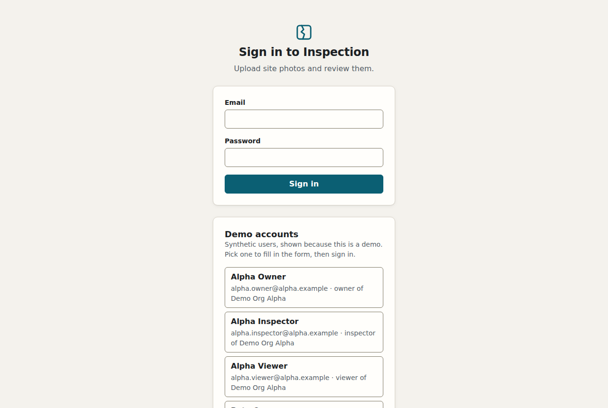
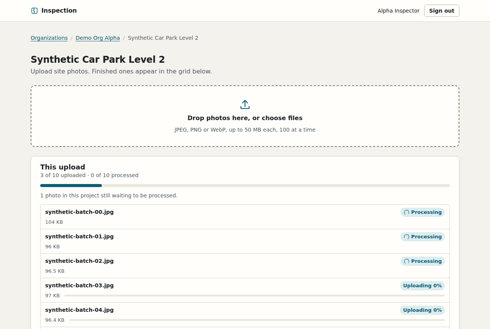
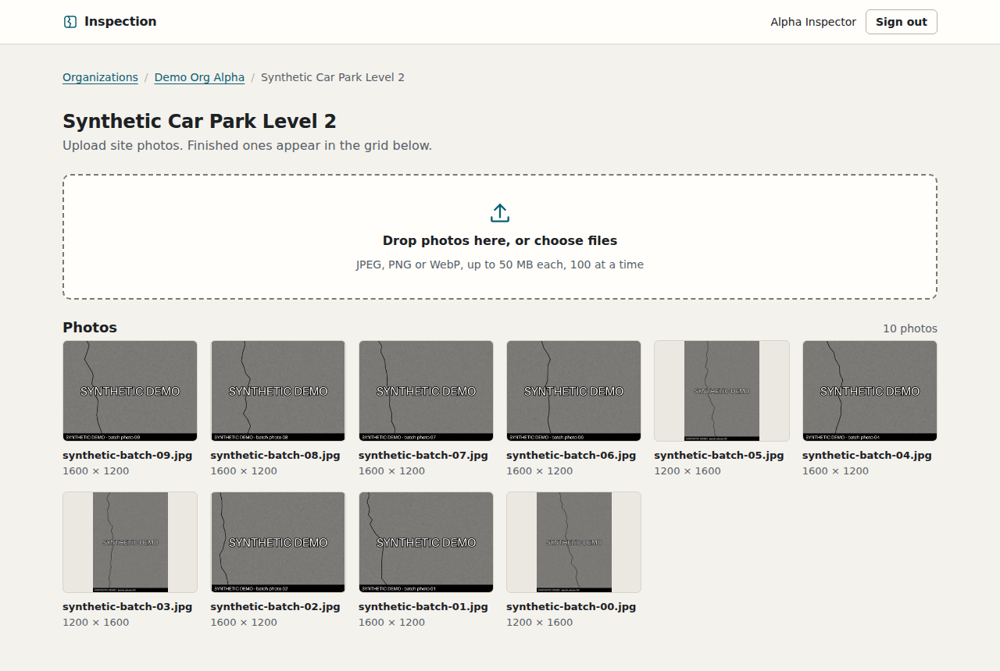

# Visual Defect Inspection SaaS

[](https://github.com/AOX-LLC/inspection-saas/actions/workflows/ci.yml)

Multi-tenant building inspection: defect detection on site photos, engineer review and PDF site reports.

Built by [AOX](https://automatedoperationsexperts.com).

## Status

Phase 2b: the API has tenancy and database isolation, login with server-side sessions, org membership and role checks, projects, and presigned image upload and download through an object store. A completed upload is cut into detector-sized tiles and a small thumbnail in the background by a worker. A web app now sits in front: sign in, open a project, drop in a batch of photos, watch them upload and get processed, and see the finished photos in a grid. There is no detector yet; it arrives in a later phase.

| Sign in | Mid-upload | Finished |
| --- | --- | --- |
|  |  |  |

The screenshots are produced by `scripts/web_walkthrough.py` against the running stack, with synthetic photos.

## Run it

Prerequisite: Docker Engine with Compose v2.

```sh
docker compose up -d --wait
```

Then open <http://127.0.0.1:4700> and sign in as one of the demo accounts the page lists (the list appears only in demo mode, which is what Compose runs).

The first run builds the API and web images (the web build is a Next.js production build and takes a minute and a good half gigabyte of memory), generates credentials, creates the databases, starts the object store, migrates and seeds. If you ran an earlier phase on this machine, run `docker compose down -v` first: new database roles and secrets are only created on a fresh volume.

```sh
curl http://127.0.0.1:4701/health
# {"status":"ok"}
```

Try it. Log in as a seeded user, list projects, and read a file through a presigned URL (the cookie jar holds the session; state-changing requests need an `Origin` header, as a browser sends):

```sh
ORG=8e35f604-8a87-4fba-b70e-e87a8e22efd1   # Demo Org Alpha
curl -s -c jar -H 'Origin: http://127.0.0.1:4700' -H 'Content-Type: application/json' \
  -d '{"email":"alpha.inspector@alpha.example","password":"synthetic-demo-password"}' \
  http://127.0.0.1:4701/auth/login
curl -s -b jar http://127.0.0.1:4701/orgs/$ORG/projects
```

`scripts/smoke.sh` walks the whole path (login, upload, complete, wait for the worker to tile it, download, cross-org 404, logout) against a running stack.

Process a batch of 50 synthetic photos in the background and see how long it takes (needs `uv`; it uses only the demo seed and generated images):

```sh
cd api && uv run python ../scripts/batch_demo.py
```

Read a project's progress yourself, as a member of its org:

```sh
curl -s -b jar http://127.0.0.1:4701/orgs/$ORG/projects/$PROJECT/photos/progress
# {"total":50,"counts":{"queued":0,"processing":0,"tiled":50,"failed":0},"finished":true}
```

Walk through the web app in a headless browser, the way a person would: sign in, upload 10 synthetic photos, watch them finish, and fail on any console error, Content-Security-Policy violation or image request that is not a thumbnail (needs `uv` and a Chromium that Playwright can drive; add `--screenshots DIR` to save pictures):

```sh
cd api && uv run --with playwright==1.58.0 python ../scripts/web_walkthrough.py
```

Run the web app's checks (Node 22 or later):

```sh
cd web && npm ci && npm run lint && npm run typecheck && npm test
```

Run the test suite: the isolation suite, the API suite, the storage suite and the worker suite. It uses its own `inspection_test` database, never the seeded one:

```sh
docker compose --profile test run --rm --build test
```

Stop with `docker compose down`. Use `docker compose down -v` to also delete the data and the generated credentials.

## Ports

All ports are bound to 127.0.0.1.

| Port | Service | Phase |
| --- | --- | --- |
| 4700 | Web app | now |
| 4701 | API | now |
| 4702 | Postgres | now |
| 4703 | Object store (S3 API) | now |

Port 4704 is reserved and unused. The object store's RPC and admin ports are not published.

## Demo data

All demo data is synthetic. The seed refuses to run unless `APP_ENV=demo`. Every demo user has the same published password, `synthetic-demo-password`; it protects nothing.

| Org | User | Role |
| --- | --- | --- |
| Demo Org Alpha | `alpha.owner@alpha.example` | owner |
| Demo Org Alpha | `alpha.inspector@alpha.example` | inspector |
| Demo Org Alpha | `alpha.viewer@alpha.example` | viewer |
| Demo Org Beta | `beta.owner@beta.example` | owner |
| Both orgs | `consultant@shared.example` | inspector |

Each org has two projects whose names start with "Synthetic", and each project has two generated placeholder images stamped "SYNTHETIC DEMO".

## Mock mode

`MODEL_MODE=mock` is the default. Recorded model responses will be replayed, so no API key is needed; nothing calls a model yet. See `.env.example`.

## How tenancy works

Every table uses Postgres row-level security, with both ENABLE and FORCE. The API and the background worker each connect as a role that owns nothing and cannot bypass RLS. Tenant context is set per transaction with `set_config(..., true)`, so it cannot leak across pooled connections. If the context is missing, a query raises an error as soon as it reaches a row, so it never returns rows. The worker finds its next job through one narrow function that returns ids only, then works inside a transaction scoped to that job's org.

More detail: [docs/architecture.md](docs/architecture.md), [ADR 0001 (object store)](docs/adr/0001-object-store.md), [ADR 0002 (authentication)](docs/adr/0002-auth.md) and [ADR 0003 (tenancy)](docs/adr/0003-tenancy.md), [ADR 0004 (job queue and worker)](docs/adr/0004-job-queue.md) and [ADR 0005 (the web tier)](docs/adr/0005-web-tier.md).

## Repository layout

```
api/                  FastAPI app, Alembic migrations, tests
web/                  Next.js app: sign-in, organizations, projects, upload and photo grid
infra/postgres/init/  roles and databases
infra/garage/         object store configuration
infra/secrets/        credential generation
scripts/              smoke test, the 50-photo batch timing script and the browser walkthrough
docs/                 architecture notes, ADRs and screenshots
compose.yaml          local stack
```

## Licence

MIT. See [LICENSE](LICENSE).
