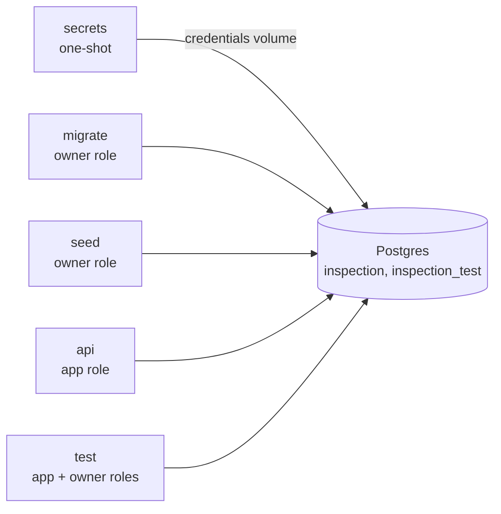

# Architecture

A multi-tenant inspection app: engineers upload site photos, a detector draws
boxes around defects, a vision model rates severity, the engineer corrects the
boxes, building-code clauses are attached for engineer review, and a PDF site
report is produced. It is built in phases; this page describes what exists
now and marks what is planned.

## Services

All services run under Docker Compose (project `inspection-saas`). Every
published port is bound to 127.0.0.1.

| Service | Port | Status | Role |
| --- | --- | --- | --- |
| `api` | 4701 | Phase 1a | FastAPI, SQLAlchemy 2 (async, psycopg 3). Today it serves `/health` only. |
| `db` | 4702 | Phase 1a | Postgres 18 with pgvector. |
| `secrets` | none | Phase 1a | One-shot. Writes random database credentials into a volume on first run. |
| `migrate` | none | Phase 1a | One-shot. Alembic migrations as the owner role. |
| `seed` | none | Phase 1a | One-shot. Synthetic demo data; refuses to run unless `APP_ENV=demo`. |
| `test` | none | Phase 1a | Profile `test`. Runs the isolation suite against `inspection_test`. |
| `objectstore` | 4703 | planned | S3-compatible object store for photos and reports. The API presigns; it never proxies bytes. |
| `web` | 4700 | planned | Web front end, same-origin with the API. |
| `worker` | none | planned | Same image as the API. Tiling, inference, the model pass, retrieval and PDFs, driven by a Postgres job queue. |

## Credentials

The repo holds no secrets, and `docker compose up` needs no `.env`. On first
run the `secrets` service writes a random password for each database role
into a named volume, one directory per consumer:

| Directory | Readable by | Holds |
| --- | --- | --- |
| `db/` | Postgres (gid 999) | superuser, owner and app passwords, for first-start role creation |
| `app/` | API (gid 10001) | the app role's password |
| `owner/` | migrate and seed (gid 10002) | the owner role's password |

The API process cannot read the owner password, so a compromised API cannot
act as the schema owner. `docker compose down -v` deletes the volume and the
next start generates new credentials.

The API, migrate, seed and test containers run as non-root users with a
read-only root filesystem, all capabilities dropped, and
`no-new-privileges`.

## Database roles

| Role | Used by | Can |
| --- | --- | --- |
| `postgres` | first start only | Superuser. Creates the roles and databases, then is not used. |
| `inspection_owner` | migrate, seed, tests | Owns the schema and every table. Bound by RLS because every table forces it. |
| `inspection_app` | API, tests | DML only. Owns nothing, no `BYPASSRLS`, cannot create objects or temporary tables. |

Alembic's version table lives in a separate `migrations` schema that the app
role cannot see.

## Tenancy

Tenant isolation is enforced in Postgres with row-level security. From
Phase 1b the API also checks membership before it sets an org context.
[ADR 0003](adr/0003-tenancy.md) has the full reasoning. In
short:

1. Each request runs one transaction. It starts by calling
   `set_config('app.org_id', ..., true)` and `set_config('app.user_id', ..., true)`
   through `api/app/db/tenant.py`. The settings end with the transaction.
2. Tenant-owned tables allow only rows whose `org_id` equals `app.org_id()`,
   for reads and writes. With no context set, the accessor raises on any row
   it checks, so no rows are ever returned.
3. Identity tables allow a user's own rows and the rows of the context org,
   and show nothing without context.
4. Children reference parents by `(org_id, id)`, so cross-org references are
   impossible at the schema level.

## Data model (Phase 1a)

| Table | Tenant-owned | Notes |
| --- | --- | --- |
| `orgs` | identity | Visible as the context org or as an org the user belongs to. |
| `users` | identity | Visible as yourself or as a member of the context org. |
| `memberships` | identity | `(org_id, user_id)`, role `owner`, `admin`, `inspector` or `viewer`. |
| `sessions` | locked | Stores only a SHA-256 of the session token. No app access; Phase 1b reaches it through SECURITY DEFINER functions. |
| `projects` | yes | |
| `files` | yes | Object key, content type, size, status. FK `(org_id, project_id)`. |
| `audit_events` | yes | Append-only for the app. |

Later phases add photos, tiles and jobs (Phase 2); detections and severity
assessments (Phases 3 and 4); building-code clauses as global reference data
with embeddings (Phase 4); annotation edits, reports and usage events
(Phases 5 to 7). Each tenant-owned table follows the same rules, and the
catalog tests fail until it does.

## Model calls

`MODEL_MODE=mock` is the default: model responses will be replayed from
recordings, so the app runs with no API key. `live` reads the viewer's own key
from `.env`. Phase 1a defines the setting only; nothing calls a model yet.

## Tests and CI

- `api/tests/db/`: the isolation suite. See ADR 0003 for what it covers.
- CI runs on every pull request and push to `main`: ruff, the full Compose
  stack with a health check, the test suite, and a gitleaks scan of the whole
  git history.
- pre-commit runs gitleaks and ruff locally.
