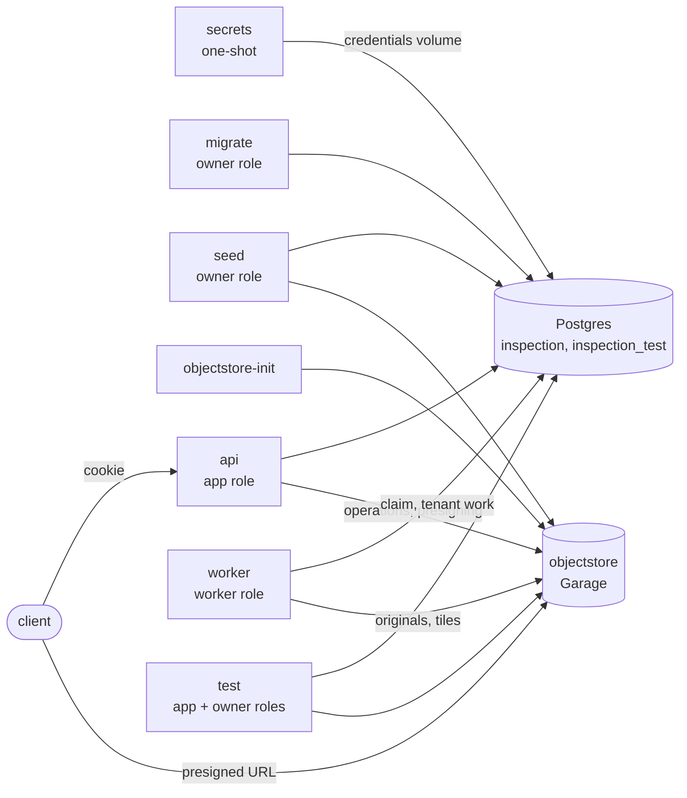

# Architecture

A multi-tenant inspection app: engineers upload site photos, a detector draws
boxes around defects, a vision model rates severity, the engineer corrects the
boxes, building-code clauses are attached for engineer review, and a PDF site
report is produced. It is built in phases; this page describes what exists
now and marks what is planned.

## Services

All services run under Docker Compose (project `inspection-saas`). Every
published port is bound to 127.0.0.1.

| Service | Port | Status | Role |
| --- | --- | --- | --- |
| `api` | 4701 | Phase 1b | FastAPI, SQLAlchemy 2 (async, psycopg 3). Health, login and logout, projects, presigned file upload and download, and batch progress. |
| `db` | 4702 | Phase 1a | Postgres 18 with pgvector. |
| `secrets` | none | Phase 1a | One-shot. Writes random database credentials into a volume on first run. |
| `objectstore` | 4703 | Phase 1b | Garage, an S3-compatible object store for photos and reports. The API presigns; it never proxies bytes. See [ADR 0001](adr/0001-object-store.md). |
| `objectstore-init` | none | Phase 1b | One-shot. Creates the layout, key, bucket and CORS on a fresh object store. |
| `migrate` | none | Phase 1a | One-shot. Alembic migrations as the owner role. |
| `seed` | none | Phase 1a | One-shot. Synthetic demo data and generated images; refuses to run unless `APP_ENV=demo`. |
| `test` | none | Phase 1a | Profile `test`. Runs the isolation, API and storage suites against `inspection_test` and the object store. |
| `web` | 4700 | planned | Web front end, same-origin with the API. |
| `worker` | none | Phase 2a | Same image as the API (`python -m app.worker`), run as the worker role with a 768 MB memory limit. Tiles photos from a Postgres job queue and does housekeeping. The detector, model pass, retrieval and PDFs arrive in later phases. See [ADR 0004](adr/0004-job-queue.md). |

## Credentials

The repo holds no secrets, and `docker compose up` needs no `.env`. On first
run the `secrets` service writes a random password for each database role
into a named volume, one directory per consumer:

| Directory | Readable by | Holds |
| --- | --- | --- |
| `db/` | Postgres (gid 999) | superuser, owner, app and worker passwords, for first-start role creation |
| `app/` | API (gid 10001) | the app role's password |
| `owner/` | migrate and seed (gid 10002) | the owner role's password |
| `worker/` | worker (gid 10006) | the worker role's password |
| `objectstore/` | object store and its init (uid 10004) | cluster RPC secret, admin token |
| `storage/` | API, worker, seed, init, tests (gid 10005) | the access key and secret the API signs with; the worker uses the same key |

The API process cannot read the owner password, so a compromised API cannot
act as the schema owner. `docker compose down -v` deletes the volume and the
next start generates new credentials.

The API, worker, migrate, seed and test containers run as non-root users with a
read-only root filesystem, all capabilities dropped, and
`no-new-privileges`.

## Database roles

| Role | Used by | Can |
| --- | --- | --- |
| `postgres` | first start only | Superuser. Creates the roles and databases, then is not used. |
| `inspection_owner` | migrate, seed, tests | Owns the schema and every table. Bound by RLS because every table forces it. |
| `inspection_app` | API, tests | DML only. Owns nothing, no `BYPASSRLS`, cannot create objects or temporary tables. Executes the `auth` functions. |
| `inspection_worker` | worker, tests | Like the app role: owns nothing, no `BYPASSRLS`, no inherited roles. Direct grants on `files`, `photos`, `tiles` and `audit_events` only, no access to `jobs`, and `EXECUTE` on the `queue` functions and `auth.purge_sessions`. See [ADR 0004](adr/0004-job-queue.md). |
| `inspection_auth` | nobody logs in | `NOLOGIN`, `BYPASSRLS`. Owns only the four SECURITY DEFINER functions in schema `auth`. The owner can `SET ROLE` to it (migrations, seed) but does not inherit it. See [ADR 0002](adr/0002-auth.md). |
| `inspection_dispatcher` | nobody logs in | `NOLOGIN`, `BYPASSRLS`. Owns only the SECURITY DEFINER functions in schema `queue`, which find the next due job across orgs. Same arrangement as the auth role. See [ADR 0004](adr/0004-job-queue.md). |

Alembic's version table lives in a separate `migrations` schema that the app
role cannot see.

## Tenancy

Tenant isolation is enforced in Postgres with row-level security. The API
also checks membership before it sets an org context.
[ADR 0003](adr/0003-tenancy.md) has the full reasoning. In
short:

1. Each request runs one transaction. It starts by calling
   `set_config('app.org_id', ..., true)` and `set_config('app.user_id', ..., true)`
   through `api/app/db/tenant.py`. The settings end with the transaction.
2. Tenant-owned tables allow only rows whose `org_id` equals `app.org_id()`,
   for reads and writes. With no context set, the accessor raises on any row
   it checks, so no rows are ever returned.
3. Identity tables allow a user's own rows and the rows of the context org,
   and show nothing without context.
4. Children reference parents by `(org_id, id)`, so cross-org references are
   impossible at the schema level.

## Authentication and access

[ADR 0002](adr/0002-auth.md) has the reasoning. Per request:

1. **Session.** The `session` cookie (`HttpOnly`, `SameSite=Lax`) holds a random
   token. The API hashes it and calls `auth.resolve_session`; an unknown, expired
   (12 h idle, 7 d absolute) or revoked session is a 401.
2. **Membership.** For a route with `{org_id}` the API looks the user up in
   `memberships` under a user-only context. No membership is a 404, the same
   answer as for an org that does not exist.
3. **Role.** `owner`, `admin` and `inspector` may write; `viewer` reads only. A
   member without the role gets a 403.
4. **Tenant context.** Only then does the handler open a `tenant_transaction`,
   and row-level security applies as before.

State-changing requests also need an allowed `Origin` header. Login is rate
limited per IP and per email, in memory.

## Files and object storage

Keys are `orgs/{org_id}/projects/{project_id}/files/{file_id}/original`, built
from database UUIDs only (`api/app/storage/keys.py`); the client's filename is
metadata and never reaches a key.

- **Upload.** `POST .../files` (writers only) inserts a `pending` row and returns
  a presigned POST whose policy pins a **staging** key
  (`.../files/{id}/upload`), one content type (`image/jpeg`, `image/png` or
  `image/webp`) and a size up to what the client declared, for 5 minutes. The
  client uploads straight to the store. `POST .../files/{id}/complete` reads the
  staged object's size and first bytes, checks that they match the declared
  type, copies it server-side to the final key (pinned to the etag it checked),
  checks the copy again, deletes the staged object, and marks the row `ready`.
  A mismatch marks it `failed` and deletes the objects. The presigned POST never
  targets the final key, so a finished upload cannot be overwritten while the
  POST is still valid. In the same transaction as `ready`, `complete` creates the
  file's photo and enqueues its tiling job.
- **Download.** `GET .../files/{id}/download` loads the row under row-level
  security, checks that its key is well formed and inside the org, and signs a
  GET that fixes the response content type to the one stored in the database and
  sends `Content-Disposition: attachment`.
- **Two clients.** Operations use the internal endpoint; presigned URLs are signed
  for `S3_PUBLIC_ENDPOINT`, the address the browser reaches, because a
  signature binds to its host.
- **Audit.** Every presign, completion and rejection is written to
  `audit_events` in the same transaction, without the URL.

## Data model (Phase 2a)

| Table | Tenant-owned | Notes |
| --- | --- | --- |
| `orgs` | identity | Visible as the context org or as an org the user belongs to. |
| `users` | identity | Visible as yourself or as a member of the context org. |
| `memberships` | identity | `(org_id, user_id)`, role `owner`, `admin`, `inspector` or `viewer`. |
| `credentials` | locked | Argon2id password hashes, apart from `users`. No direct app access (no grant, no policy); the app obtains a hash only through `auth.verify_login`. |
| `sessions` | locked | Stores only a SHA-256 of the session token. No app access; reached only through the `auth` functions. |
| `projects` | yes | |
| `files` | yes | Object key, content type, size, status. FK `(org_id, project_id)`. |
| `audit_events` | yes | Append-only for the app. |
| `photos` | yes | One per uploaded image: status `queued`, `processing`, `tiled` or `failed`, and its size once decoded. FK `(org_id, file_id)` and `(org_id, project_id)`. The API inserts and reads; the worker updates. |
| `tiles` | yes | Where each tile sits in the oriented original (`x`, `y`, `src_width`, `src_height`), its `scale`, and its object key. Level 0 is full resolution, level 1 one overview. Written by the worker. |
| `jobs` | yes | The queue. Payload is ids only (a CHECK). The API may insert; nothing but the `queue` functions reads or changes them. |

Later phases add detections and severity assessments (Phases 3 and 4); building-code clauses as global reference data
with embeddings (Phase 4); annotation edits, reports and usage events
(Phases 5 to 7). Each tenant-owned table follows the same rules, and the
catalog tests fail until it does.

## Jobs and the worker

[ADR 0004](adr/0004-job-queue.md) has the reasoning. In short:

1. **Enqueue.** The API writes a job in the same transaction as the row that
   needs it. An insert trigger sends `NOTIFY inspection_jobs`, delivered at
   commit.
2. **Claim.** A worker wakes on the notification or on its poll, and calls
   `queue.jobs_claim`, which returns the next due job's id, org id, kind and an
   id-only payload. The claim sets `locked_until`; a job whose worker died is
   claimed again once the lock lapses. Attempts back off exponentially and end in
   a `failed` state. `jobs_complete` and `jobs_fail` check `locked_by`.
3. **Work under row-level security.** The worker opens a tenant transaction for
   the claimed job's org and reads and writes through the same policies as the
   API.
4. **Tiling** (`tile_photo`). Decode under a pixel limit, apply the EXIF
   orientation, cut 640-pixel tiles with 128 pixels of overlap plus one
   overview, write them under `.../photos/{photo_id}/tiles/`, then record each
   tile's position and scale and mark the photo `tiled`. A box found in a tile
   maps back with `original = origin + tile_px / scale`. Tile size, overlap and
   limits are settings (`TILE_SIZE`, `TILE_OVERLAP`, `MAX_IMAGE_PIXELS`,
   `MAX_TILES_PER_PHOTO`).
5. **Progress.** `GET /orgs/{org_id}/projects/{project_id}/photos/progress`
   returns counts of the project's photos by status, to any member.
6. **Housekeeping.** Periodically: abandoned uploads (row and staged object) are
   removed, staging keys of finished uploads are swept, and dead sessions are
   purged through `auth.purge_sessions`.

## Model calls

`MODEL_MODE=mock` is the default: model responses will be replayed from
recordings, so the app runs with no API key. `live` reads the viewer's own key
from `.env`. Phase 1a defines the setting only; nothing calls a model yet.

## Tests and CI

- `api/tests/db/`: the isolation suite and the catalog checks. See ADR 0003 for
  what it covers. The catalog tests also pin the `auth` role (attributes,
  membership, ownership, grants), the owner and EXECUTE rights of every SECURITY
  DEFINER function, and that a global table never grants the app write access.
- `api/tests/api/`: the HTTP suite. Login and sessions, the Origin check, the
  rate limit, roles, the upload pipeline, and a route walker that discovers every
  route and tries to reach another org's data through it.
- `api/tests/storage/`: the key builder, presigned URLs, and server-side copy
  against the real object store.
- `api/tests/worker/`: the worker against the real database and object store:
  tiling geometry, orientation and decompression limits, retries and crash
  recovery, wake-up and polling, concurrency, housekeeping.
- `api/tests/db/` also pins the worker and dispatcher roles and grants and the
  queue functions: a worker holding one org's job cannot reach another's rows, a
  dead worker's job is reclaimed, and the claim exposes only its four columns.
- `api/tests/api/test_batch.py` uploads 50 synthetic photos through the API, runs
  a worker, and reads the counts back through the progress endpoint.
- CI runs on every pull request and push to `main`: ruff, the full Compose
  stack with a health check, the test suite, a smoke job (`scripts/smoke.sh`: log
  in, upload, wait for the worker to tile it, download, cross-org 404), and a
  gitleaks scan of the whole git history.
- pre-commit runs gitleaks and ruff locally.
